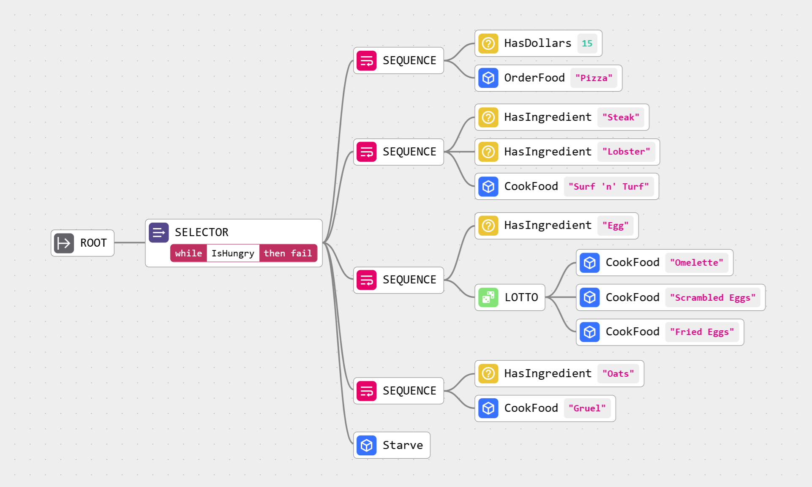

#  MistreevousSharp

[](https://www.nuget.org/packages/MistreevousSharp)

**MistreevousSharp** is a lightweight, C# behaviour tree library for .NET 9.0 and .NET Standard 2.1, ported from the original [mistreevous](https://github.com/nikkorn/mistreevous) TypeScript library. Define complex AI behaviours using either JSON or a clean, minimal DSL (MDSL). Built for modularity, clarity, and fast iteration — perfect for games, simulations, and interactive agents.



### ✨ Key Features

🔹 **Minimal DSL or JSON-based definitions** – define behaviours clearly and concisely  
🔹 **Built-in composite, decorator & leaf nodes** – model complex logic using a toolbox of predefined node types  
🔹 **Async & promise-based actions** – handle long-running behaviours and actions asynchronously  
🔹 **Lifecycle callbacks** – define callbacks to invoke when tree nodes start, resume, or finish processing  
🔹 **Global functions & subtrees** – reuse logic and subtree definitions across multiple agents  
🔹 **Guards** – dynamically interrupt or cancel long-running behaviours  
🔹 **Randomised behaviour** – weighted choices, random delays, seedable RNG for deterministic tree processing  
🔹 **Debugging tools** – inspect the state of running tree instances and track node state changes  
🔹 **Optimized for performance** – reduced memory allocations, perfect for Unity, Godot, or game servers  
🔹 **Cross-platform** – works on .NET 9.0, .NET Standard 2.1, Unity, and more  

🌳 **What are Behaviour Trees?**  
Behaviour trees are hierarchical structures designed to model decision-making processes and are used to create complex AI via the modular composition of individual tasks, making it easy to sequence actions, handle conditions, and control flow in a readable and maintainable way.

🛠️ There is an in-browser editor and tree visualiser for the original TypeScript library that you can try [HERE](https://nikkorn.github.io/mistreevous-visualiser/index.html?example=sorting-lunch) (MDSL definitions are compatible!)

## Install

### NuGet Package Manager
```powershell
Install-Package MistreevousSharp
```

### .NET CLI
```bash
dotnet add package MistreevousSharp
```

### PackageReference
```xml
<PackageReference Include="MistreevousSharp" Version="1.0.0" />
```

## Example

```csharp
using Mistreevous;

// Define some behaviour for an agent.
var definition = @"root {
    sequence {
        action [Walk]
        action [Fall]
        action [Laugh]
    }
}";

// Create an agent that we will be modelling the behaviour for.
var agent = new MyAgent();

// Create the behaviour tree, passing our tree definition and the agent.
var behaviourTree = new BehaviourTree(definition, agent);

// Step the tree.
behaviourTree.Step();

// Output:
// 'walking!'
// 'falling!'
// 'laughing!'
```

### Agent Implementation

```csharp
public class MyAgent : IAgent
{
    public object? this[string propertyName] => 
        GetType().GetProperty(propertyName)?.GetValue(this);

    public State Walk()
    {
        Console.WriteLine("walking!");
        return State.Succeeded;
    }

    public State Fall()
    {
        Console.WriteLine("falling!");
        return State.Succeeded;
    }

    public State Laugh()
    {
        Console.WriteLine("laughing!");
        return State.Succeeded;
    }
}
```

## Behaviour Tree Methods

#### IsRunning()
Returns `true` if the tree is in the `RUNNING` state, otherwise `false`.

#### GetState()
Gets the current tree state of `SUCCEEDED`, `FAILED`, `READY` or `RUNNING`.

#### Step()
Carries out a node update that traverses the tree from the root node outwards to any child nodes, skipping those that are already in a resolved state of `SUCCEEDED` or `FAILED`. After being updated, leaf nodes will have a state of `SUCCEEDED`, `FAILED` or `RUNNING`. Leaf nodes that are left in the `RUNNING` state as part of a tree step will be revisited each subsequent step until they move into a resolved state of either `SUCCEEDED` or `FAILED`, after which execution will move through the tree to the next node with a state of `READY`.

Calling this method when the tree is already in a resolved state of `SUCCEEDED` or `FAILED` will cause it to be reset before tree traversal begins.

#### Reset()
Resets the tree from the root node outwards to each nested node, giving each a state of `READY`.

#### GetTreeNodeDetails()
Gets the details of every node in the tree, starting from the root. This will include the current state of each node, which is useful for debugging a running tree instance.

## Behaviour Tree Options

The `BehaviourTree` constructor can take an options object as an argument, the properties of which are shown below.

| Option          | Type | Description |
| :--------------------|:- |:- |
| GetDeltaTime | `Func<double>` | A function returning a delta time in seconds that is used to calculate the elapsed duration of any `wait` nodes. If this function is not defined then `DateTime.UtcNow` is used instead by default.  |
| Random | `Func<double>` | A function returning a floating-point number between 0 (inclusive) and 1 (exclusive). If defined, this function is used to source a pseudo-random number to use in operations such as the selection of active children for any `lotto` nodes as well as the selection of durations for `wait` nodes, iterations for `repeat` nodes and attempts for `retry` nodes when minimum and maximum bounds are defined. If not defined then `Random.NextDouble()` will be used instead by default. This function can be useful in seeding all random numbers used in the running of a tree instance to make any behaviour completely deterministic. |
| OnNodeStateChange | `Action<NodeStateChange>` | An event handler that is called whenever the state of a node changes. The change object will contain details of the updated node and will include the previous state and current state. |

## Nodes

## States
Behaviour tree nodes can be in one of the following states:
- **READY** A node is in the `READY` state when it has not been visited yet in the execution of the tree.
- **RUNNING** A node is in the `RUNNING` state when it is still being processed, these nodes will usually represent or encompass a long-running action.
- **SUCCEEDED** A node is in a `SUCCEEDED` state when it is no longer being processed and has succeeded.
- **FAILED** A node is in the `FAILED` state when it is no longer being processed but has failed.

## Composite Nodes
Composite nodes wrap one or more child nodes, each of which will be processed in a sequence determined by the type of the composite node. A composite node will remain in the `RUNNING` state until it is finished processing the child nodes, after which the state of the composite node will reflect the success or failure of the child nodes.

### Sequence
This composite node will update each child node in sequence. It will move to the `SUCCEEDED` state if all of its children have moved to the `SUCCEEDED` state and will move to the `FAILED` state if any of its children move to the `FAILED` state. This node will remain in the `RUNNING` state if one of its children remains in the `RUNNING` state.

*MDSL*
```
root {
    sequence {
        action [Walk]
        action [Fall]
        action [Laugh]
    }
}
```

*JSON*
```json
{
    "type": "root",
    "child": {
        "type": "sequence",
        "children": [
            {
                "type": "action",
                "call": "Walk"
            },
            {
                "type": "action",
                "call": "Fall"
            },
            {
                "type": "action",
                "call": "Laugh"
            }
        ]
    }
}
```

### Selector
This composite node will update each child node in sequence. It will move to the `FAILED` state if all of its children have moved to the `FAILED` state and will move to the `SUCCEEDED` state if any of its children move to the `SUCCEEDED` state. This node will remain in the `RUNNING` state if one of its children is in the `RUNNING` state.

*MDSL*
```
root {
    selector {
        action [TryThis]
        action [ThenTryThis]
        action [TryThisLast]
    }
}
```

*JSON*
```json
{
    "type": "root",
    "child": {
        "type": "selector",
        "children": [
            {
                "type": "action",
                "call": "TryThis"
            },
            {
                "type": "action",
                "call": "ThenTryThis"
            },
            {
                "type": "action",
                "call": "TryThisLast"
            }
        ]
    }
}
```

### Parallel
This composite node will update each child node concurrently. It will move to the `SUCCEEDED` state if all of its children have moved to the `SUCCEEDED` state and will move to the `FAILED` state if any of its children move to the `FAILED` state, otherwise it will remain in the `RUNNING` state.

*MDSL*
```
root {
    parallel {
        action [RubBelly]
        action [PatHead]
    }
}
```

*JSON*
```json
{
    "type": "root",
    "child": {
        "type": "parallel",
        "children": [
            {
                "type": "action",
                "call": "RubBelly"
            },
            {
                "type": "action",
                "call": "PatHead"
            }
        ]
    }
}
```

### Race
This composite node will update each child node concurrently. It will move to the `SUCCEEDED` state if any of its children have moved to the `SUCCEEDED` state and will move to the `FAILED` state if all of its children move to the `FAILED` state, otherwise it will remain in the `RUNNING` state.

*MDSL*
```
root {
    race {
        action [UnlockDoor]
        action [FindAlternativePath]
    }
}
```

*JSON*
```json
{
    "type": "root",
    "child": {
        "type": "race",
        "children": [
            {
                "type": "action",
                "call": "UnlockDoor"
            },
            {
                "type": "action",
                "call": "FindAlternativePath"
            }
        ]
    }
}
```

### All
This composite node will update each child node concurrently. It will stay in the `RUNNING` state until all of its children have moved to either the `SUCCEEDED` or `FAILED` state, after which this node will move to the `SUCCEEDED` state if any of its children have moved to the `SUCCEEDED` state, otherwise it will move to the `FAILED` state.

*MDSL*
```
root {
    all {
        action [Reload]
        action [MoveToCover]
    }
}
```

*JSON*
```json
{
    "type": "root",
    "child": {
        "type": "all",
        "children": [
            {
                "type": "action",
                "call": "Reload"
            },
            {
                "type": "action",
                "call": "MoveToCover"
            }
        ]
    }
}
```

### Lotto
This composite node will select a single child at random to run as the active running node. The state of this node will reflect the state of the active child.

*MDSL*
```
root {
    lotto {
        action [MoveLeft]
        action [MoveRight]
    }
}
```

*JSON*
```json
{
    "type": "root",
    "child": {
        "type": "lotto",
        "children": [
            {
                "type": "action",
                "call": "MoveLeft"
            },
            {
                "type": "action",
                "call": "MoveRight"
            }
        ]
    }
}
```

A probability weight can be defined for each child node as an optional integer node argument in MDSL, influencing the likelihood that a particular child will be picked. In JSON this would be done by setting a value of an array containing the integer weight values for the `weights` property.

*MDSL*
```
root {
    lotto [10,5,3,1] {
        action [CommonAction]
        action [UncommonAction]
        action [RareAction]
        action [VeryRareAction]
    }
}
```

*JSON*
```json
{
    "type": "root",
    "child": {
        "type": "lotto",
        "children": [
            {
                "type": "action",
                "call": "CommonAction"
            },
            {
                "type": "action",
                "call": "UncommonAction"
            },
            {
                "type": "action",
                "call": "RareAction"
            },
            {
                "type": "action",
                "call": "VeryRareAction"
            }
        ],
        "weights": [10, 5, 3, 1]
    }
}
```

## Decorator Nodes
A decorator node is similar to a composite node, but it can only have a single child node. The state of a decorator node is usually some transformation of the state of the child node. Decorator nodes are also used to repeat or terminate the execution of a particular node.

### Root
This decorator node represents the root of a behaviour tree and cannot be the child of another composite node.

The state of a root node will reflect the state of its child node.

*MDSL*
```
root {
    action [Dance]
}
```

*JSON*
```json
{
    "type": "root",
    "child": {
        "type": "action",
        "call": "Dance"
    }
}
```

Additional named root nodes can be defined and reused throughout a definition. Other root nodes can be referenced via the **branch** node. Exactly one root node must be left unnamed, this root node will be used as the main root node for the entire tree.

*MDSL*
```
root {
    branch [SomeOtherTree]
}

root [SomeOtherTree] {
    action [Dance]
}
```

*JSON*
```json
[
    {
        "type": "root",
        "child": {
            "type": "branch",
            "ref": "SomeOtherTree"
        }
    },
    {
        "type": "root",
        "id": "SomeOtherTree",
        "child": {
            "type": "action",
            "call": "Dance"
        }
    }
]
```

### Repeat
This decorator node will repeat the execution of its child node if the child moves to the `SUCCEEDED` state. It will do this until either the child moves to the `FAILED` state, at which point the repeat node will move to the `FAILED` state, or the maximum number of iterations is reached, which moves the repeat node to the `SUCCEEDED` state. This node will be in the `RUNNING` state if its child is also in the `RUNNING` state, or if further iterations need to be made.

The maximum number of iterations can be defined as a single integer iteration argument in MDSL, or by setting the `iterations` property in JSON. In the example below, we would be repeating the action **SomeAction** 5 times.

*MDSL*
```
root {
    repeat [5] {
        action [SomeAction]
    }
}
```

*JSON*
```json
{
    "type": "root",
    "child": {
        "type": "repeat",
        "iterations": 5,
        "child": {
            "type": "action",
            "call": "SomeAction"
        }
    }
}
```

The number of iterations to make can be selected at random within a lower and upper bound if these are defined as two integer arguments in MDSL, or by setting a value of an array containing two integer values for the `iterations` property in JSON. In the example below, we would be repeating the action **SomeAction** between 1 and 5 times.

*MDSL*
```
root {
    repeat [1,5] {
        action [SomeAction]
    }
}
```

*JSON*
```json
{
    "type": "root",
    "child": {
        "type": "repeat",
        "iterations": [1, 5],
        "child": {
            "type": "action",
            "call": "SomeAction"
        }
    }
}
```

The maximum number of iterations to make can be omitted. This would result in the child node being run infinitely, as can be seen in the example below.

*MDSL*
```
root {
    repeat {
        action [SomeAction]
    }
}
```

*JSON*
```json
{
    "type": "root",
    "child": {
        "type": "repeat",
        "child": {
            "type": "action",
            "call": "SomeAction"
        }
    }
}
```

### Retry
This decorator node will repeat the execution of its child node if the child moves to the `FAILED` state. It will do this until either the child moves to the `SUCCEEDED` state, at which point the retry node will move to the `SUCCEEDED` state or the maximum number of attempts is reached, which moves the retry node to the `FAILED` state. This node will be in a `RUNNING` state if its child is also in the `RUNNING` state, or if further attempts need to be made.

The maximum number of attempts can be defined as a single integer attempt argument in MDSL, or by setting the `attempts` property in JSON. In the example below, we would be retrying the action **SomeAction** 5 times.

*MDSL*
```
root {
    retry [5] {
        action [SomeAction]
    }
}
```

*JSON*
```json
{
    "type": "root",
    "child": {
        "type": "retry",
        "attempts": 5,
        "child": {
            "type": "action",
            "call": "SomeAction"
        }
    }
}
```

The number of attempts to make can be selected at random within a lower and upper bound if these are defined as two integer arguments in MDSL, or by setting a value of an array containing two integer values for the `attempts` property in JSON. In the example below, we would be retrying the action **SomeAction** between 1 and 5 times.

*MDSL*
```
root {
    retry [1,5] {
        action [SomeAction]
    }
}
```

*JSON*
```json
{
    "type": "root",
    "child": {
        "type": "retry",
        "attempts": [1, 5],
        "child": {
            "type": "action",
            "call": "SomeAction"
        }
    }
}
```

The maximum number of attempts to make can be omitted. This would result in the child node being run infinitely until it moves to the `SUCCEEDED` state, as can be seen in the example below.

*MDSL*
```
root {
    retry {
        action [SomeAction]
    }
}
```

*JSON*
```json
{
    "type": "root",
    "child": {
        "type": "retry",
        "child": {
            "type": "action",
            "call": "SomeAction"
        }
    }
}
```

### Flip
This decorator node will move to the `SUCCEEDED` state when its child moves to the `FAILED` state, and it will move to the `FAILED` if its child moves to the `SUCCEEDED` state. This node will remain in the `RUNNING` state if its child is in the `RUNNING` state.

*MDSL*
```
root {
    flip {
        action [SomeAction]
    }
}
```

*JSON*
```json
{
    "type": "root",
    "child": {
        "type": "flip",
        "child": {
            "type": "action",
            "call": "SomeAction"
        }
    }
}
```

### Succeed
This decorator node will move to the `SUCCEEDED` state when its child moves to either the `FAILED` state or the `SUCCEEDED` state. This node will remain in the `RUNNING` state if its child is in the `RUNNING` state.

*MDSL*
```
root {
    succeed {
        action [SomeAction]
    }
}
```

*JSON*
```json
{
    "type": "root",
    "child": {
        "type": "succeed",
        "child": {
            "type": "action",
            "call": "SomeAction"
        }
    }
}
```

### Fail
This decorator node will move to the `FAILED` state when its child moves to either the `FAILED` state or the `SUCCEEDED` state. This node will remain in the `RUNNING` state if its child is in the `RUNNING` state.

*MDSL*
```
root {
    fail {
        action [SomeAction]
    }
}
```

*JSON*
```json
{
    "type": "root",
    "child": {
        "type": "fail",
        "child": {
            "type": "action",
            "call": "SomeAction"
        }
    }
}
```

## Leaf Nodes
Leaf nodes are the lowest-level node type and cannot be the parent of other child nodes.

### Action
An action node represents an action that can be completed immediately as part of a single tree step, or ongoing behaviour that can take a prolonged amount of time and may take multiple tree steps to complete. Each action node will correspond to some action that can be carried out by the agent, where the first action node argument (if using MDSL, or the `call` property if using JSON) will be an identifier matching the name of the corresponding agent action function or globally registered function.

An agent action function can optionally return a value of **State.Succeeded**, **State.Failed** or **State.Running**. If the **State.Succeeded** or **State.Failed** state is returned, then the action will move to that state.

*MDSL*
```
root {
    action [Attack]
}
```

*JSON*
```json
{
    "type": "root",
    "child": {
        "type": "action",
        "call": "Attack"
    }
}
```

```csharp
public class MyAgent : IAgent
{
    public object? this[string propertyName] => 
        GetType().GetProperty(propertyName)?.GetValue(this);

    public State Attack()
    {
        // If we do not have a weapon then we cannot attack.
        if (!IsHoldingWeapon())
        {
            // We have failed to carry out an attack!
            return State.Failed;
        }

        // ... Attack with swiftness and precision ...

        // We have carried out our attack.
        return State.Succeeded;
    }
}
```

If no value or a value of **State.Running** is returned from the action function the action node will move into the `RUNNING` state and no following nodes will be processed as part of the current tree step. In the example below, any action node that references **WalkToPosition** will remain in the `RUNNING` state until the target position is reached.

```csharp
public State WalkToPosition()
{
    // ... Walk towards the position we are trying to reach ...

    // Check whether we have finally reached the target position.
    if (IsAtTargetPosition())
    {
        // We have finally reached the target position!
        return State.Succeeded;
    }

    // We have not reached the target position yet.
    return State.Running;
}
```

Further steps of the tree will resume processing from leaf nodes that were left in the `RUNNING` state until those nodes move to either the `SUCCEEDED` or `FAILED` state or processing of the running branch is aborted via a guard.

#### Async Actions
As well as returning a finished action state from an action function, you can also return a `Task<State>` that should eventually resolve with a finished state of **State.Succeeded** or **State.Failed** as its value. The action will remain in the `RUNNING` state until the task is fulfilled, and any following tree steps will not call the action function again.

```csharp
public async Task<State> SomeAsyncAction()
{
    await Task.Delay(5000);
    return State.Succeeded;
}
```

#### Optional Arguments
Arguments can optionally be passed to agent action functions. In MDSL these optional arguments must be defined after the action name identifier argument and can be a `number`, `string`, `boolean`, `null` or agent property reference. If using JSON then these arguments are defined in an `args` array and these arguments can be any valid JSON.

*MDSL*
```
root {
    action [Say, "hello world", 5, true]
}
```

*JSON*
```json
{
    "type": "root",
    "child": {
        "type": "action",
        "call": "Say",
        "args": ["hello world", 5, true]
    }
}
```

```csharp
public State Say(string dialog, int times = 1, bool sayLoudly = false)
{
    for (int index = 0; index < times; index++)
    {
        ShowDialog(sayLoudly ? dialog.ToUpper() + "!!!" : dialog);
    }

    return State.Succeeded;
}
```

### Condition
A Condition node will immediately move into either a `SUCCEEDED` or `FAILED` state based on the boolean result of calling either an agent function or globally registered function. The first condition node argument will be an identifier matching the name of the corresponding agent condition function or globally registered function (if using MDSL, or the `call` property if using JSON).

*MDSL*
```
root {
    sequence {
        condition [HasWeapon]
        action [Attack]
    }
}
```

*JSON*
```json
{
    "type": "root",
    "child": {
        "type": "sequence",
        "children": [
            {
                "type": "condition",
                "call": "HasWeapon"
            },
            {
                "type": "action",
                "call": "Attack"
            }
        ]
    }
}
```

```csharp
public class MyAgent : IAgent
{
    public object? this[string propertyName] => 
        GetType().GetProperty(propertyName)?.GetValue(this);

    public bool HasWeapon() => IsHoldingWeapon();
    public State Attack() => AttackPlayer();
}
```

#### Optional Arguments
Arguments can optionally be passed to agent condition functions in the same way as action nodes. In MDSL these optional arguments must be defined after the condition name identifier argument, and can be a `number`, `string`, `boolean`, `null` or agent property reference.

*MDSL*
```
root {
    sequence {
        condition [HasItem, "potion"]
    }
}
```

*JSON*
```json
{
    "type": "root",
    "child": {
        "type": "sequence",
        "children": [
            {
                "type": "condition",
                "call": "HasItem",
                "args": ["potion"]
            }
        ]
    }
}
```

```csharp
public bool HasItem(string itemName) => Inventory.Contains(itemName);
```

### Wait
A wait node will remain in a `RUNNING` state for a specified duration, after which it will move into the `SUCCEEDED` state. The duration in milliseconds can be defined as an optional single integer node argument in MDSL, or by setting a value for the `duration` property in JSON.

*MDSL*
```
root {
    repeat {
        sequence {
            action [FireWeapon]
            wait [2000]
        }
    }
}
```

*JSON*
```json
{
    "type": "root",
    "child": {
        "type": "repeat",
        "child": {
            "type": "sequence",
            "children": [
                {
                    "type": "action",
                    "call": "FireWeapon"
                },
                {
                    "type": "wait",
                    "duration": 2000
                }
            ]
        }
    }
}
```

In the above example, we are using a wait node to wait 2 seconds between each run of the **FireWeapon** action.

The duration to wait in milliseconds can also be selected at random within a lower and upper bound if these are defined as two integer node arguments in MDSL, or by setting a value of an array containing two integer values for the `duration` property in JSON. In the example below, we would run the **PickUpProjectile** action and then wait for 2 to 8 seconds before running the **ThrowProjectile** action.

*MDSL*
```
root {
    sequence {
        action [PickUpProjectile]
        wait [2000, 8000]
        action [ThrowProjectile]
    }
}
```

*JSON*
```json
{
    "type": "root",
    "child": {
        "type": "sequence",
        "children": [
            {
                "type": "action",
                "call": "PickUpProjectile"
            },
            {
                "type": "wait",
                "duration": [2000, 8000]
            },
            {
                "type": "action",
                "call": "ThrowProjectile"
            }
        ]
    }
}
```

If no duration is defined then the wait node will remain in the `RUNNING` state indefinitely until it is aborted.

*MDSL*
```
root {
    wait
}
```

*JSON*
```json
{
    "type": "root",
    "child": {
        "type": "wait"
    }
}
```

### Branch
Named root nodes can be referenced using the **branch** node. This node acts as a placeholder that will be replaced by the child node of the referenced root node. All definitions below are synonymous.

*MDSL*
```
root {
    branch [SomeOtherTree]
}

root [SomeOtherTree] {
    action [Dance]
}
```

```
root {
    action [Dance]
}
```

*JSON*
```json
[
    {
        "type": "root",
        "child": {
            "type": "branch",
            "ref": "SomeOtherTree"
        }
    },
    {
        "type": "root",
        "id": "SomeOtherTree",
        "child": {
            "type": "action",
            "call": "Dance"
        }
    }
]
```

```json
{
    "type": "root",
    "child": {
        "type": "action",
        "call": "Dance"
    }
}
```

## Callbacks
Callbacks can be defined for tree nodes and will be invoked as the node is processed during a tree step. Any number of callbacks can be attached to a node as long as there are not multiple callbacks of the same type.

Callbacks are perfect for triggering animations, effects, sounds, logging, or side effects without bloating your action functions.

Optional arguments can be defined for callback functions in the same way as action and condition functions.

### Entry
An **entry** callback defines an agent function or globally registered function to call whenever the associated node moves into the `RUNNING` state when it is first visited.

*MDSL*
```
root {
    sequence entry(StartWalkingAnimation)  {
        action [WalkNorthOneSpace]
        action [WalkEastOneSpace]
        action [WalkSouthOneSpace]
        action [WalkWestOneSpace]
    }
}
```

*JSON*
```json
{
    "type": "root",
    "child": {
        "type": "sequence",
        "entry": {
            "call": "StartWalkingAnimation"
        },
        "children": [
            {
                "type": "action",
                "call": "WalkNorthOneSpace"
            },
            {
                "type": "action",
                "call": "WalkEastOneSpace"
            },
            {
                "type": "action",
                "call": "WalkSouthOneSpace"
            },
            {
                "type": "action",
                "call": "WalkWestOneSpace"
            }
        ]
    }
}
```

### Exit
An **exit** callback defines an agent function or globally registered function to call whenever the associated node moves to a state of `SUCCEEDED` or `FAILED` or is aborted. A results object is passed to the referenced function containing the **succeeded** and **aborted** boolean properties.

*MDSL*
```
root {
    sequence entry(StartWalkingAnimation) exit(StopWalkingAnimation) {
        action [WalkNorthOneSpace]
        action [WalkEastOneSpace]
        action [WalkSouthOneSpace]
        action [WalkWestOneSpace]
    }
}
```

*JSON*
```json
{
    "type": "root",
    "child": {
        "type": "sequence",
        "entry": {
            "call": "StartWalkingAnimation"
        },
        "exit": {
            "call": "StopWalkingAnimation"
        },
        "children": [
            {
                "type": "action",
                "call": "WalkNorthOneSpace"
            },
            {
                "type": "action",
                "call": "WalkEastOneSpace"
            },
            {
                "type": "action",
                "call": "WalkSouthOneSpace"
            },
            {
                "type": "action",
                "call": "WalkWestOneSpace"
            }
        ]
    }
}
```

### Step
A **step** callback defines an agent function or globally registered function to call whenever the associated node is updated as part of a tree step.

*MDSL*
```
root {
    sequence step(OnMoving) {
        action [WalkNorthOneSpace]
        action [WalkEastOneSpace]
        action [WalkSouthOneSpace]
        action [WalkWestOneSpace]
    }
}
```

*JSON*
```json
{
    "type": "root",
    "child": {
        "type": "sequence",
        "step": {
            "call": "OnMoving"
        },
        "children": [
            {
                "type": "action",
                "call": "WalkNorthOneSpace"
            },
            {
                "type": "action",
                "call": "WalkEastOneSpace"
            },
            {
                "type": "action",
                "call": "WalkSouthOneSpace"
            },
            {
                "type": "action",
                "call": "WalkWestOneSpace"
            }
        ]
    }
}
```

#### Optional Arguments
Arguments can optionally be passed to agent callback functions and can be a `number`, `string`, `boolean`, `null` or agent property reference.

*MDSL*
```
root {
    action [Walk] entry(OnMovementStart, "walking")
}
```

*JSON*
```json
{
    "type": "root",
    "child": {
        "type": "action",
        "call": "Walk",
        "entry": {
            "call": "OnMovementStart",
            "args": [
                "walking"
            ]
        }
    }
}
```

## Guards
A guard defines a condition that must be met in order for the associated node to remain active. Any nodes in the `RUNNING` state will have their guard condition evaluated for each leaf node update and will move to the `FAILED` state by default if the guard condition is not met.

This functionality is useful as a means of aborting long-running actions or branches that span across multiple steps of the tree.

*MDSL*
```
root {
    wait while(CanWait)
}
```

*JSON*
```json
{
    "type": "root",
    "child": {
        "type": "wait",
        "while": {
            "call": "CanWait"
        }
    }
}
```

In the above example, we have a **wait** node that waits indefinitely. We are using a **while** guard to give up on waiting if the guard function **CanWait** returns false during a tree step.

#### Optional Arguments
Arguments can optionally be passed to agent guard functions and can be a `number`, `string`, `boolean`, `null` or agent property reference.

*MDSL*
```
root {
    action [Run] while(HasItemEquipped, "running-shoes")
}
```
```
root {
    action [Gamble] until(HasGold, 1000)
}
```

*JSON*
```json
{
    "type": "root",
    "child": {
        "type": "action",
        "call": "Run",
        "while": {
            "call": "HasItemEquipped",
            "args": [
                "running-shoes"
            ]
        }
    }
}
```
```json
{
    "type": "root",
    "child": {
        "type": "action",
        "call": "Gamble",
        "until": {
            "call": "HasGold",
            "args": [
                1000
            ]
        }
    }
}
```

### While
A **while** guard will be satisfied as long as its condition evaluates to true.

*MDSL*
```
root {
    sequence while(IsWandering) {
        action [Whistle]
        wait [5000]
        action [Yawn]
        wait [5000]
    }
}
```

*JSON*
```json
{
    "type": "root",
    "child": {
        "type": "sequence",
        "while": {
            "call": "IsWandering"
        },
        "children": [
            {
                "type": "action",
                "call": "Whistle"
            },
            {
                "type": "wait",
                "duration": 5000
            },
            {
                "type": "action",
                "call": "Yawn"
            },
            {
                "type": "wait",
                "duration": 5000
            }
        ]
    }
}
```

### Until
An **until** guard will be satisfied as long as its condition evaluates to false.

*MDSL*
```
root {
    sequence until(CanSeePlayer) {
        action [LookLeft]
        wait [5000]
        action [LookRight]
        wait [5000]
    }
}
```

*JSON*
```json
{
    "type": "root",
    "child": {
        "type": "sequence",
        "until": {
            "call": "CanSeePlayer"
        },
        "children": [
            {
                "type": "action",
                "call": "LookLeft"
            },
            {
                "type": "wait",
                "duration": 5000
            },
            {
                "type": "action",
                "call": "LookRight"
            },
            {
                "type": "wait",
                "duration": 5000
            }
        ]
    }
}
```

#### Defining Aborted Node State
When aborted via a guard, a node will move to the `FAILED` state by default. Optionally, the state that the node should move to when aborted can be specified with `then succeed` or `then fail` following the guard definition when using MDSL, or by setting the `succeedOnAbort` boolean property when using a JSON definition.

*MDSL*
```
root {
    sequence {
        wait until(CanAttack) then succeed
        action [Attack]
    }
}
```

*JSON*
```json
{
    "type": "root",
    "child": {
        "type": "sequence",
        "children": [
            {
                "type": "wait",
                "until": {
                    "call": "CanAttack",
                    "succeedOnAbort": true
                }
            },
            {
                "type": "action",
                "call": "Attack"
            }
        ]
    }
}
```

### Referencing Agent Properties as Arguments

In addition to passing literal values (`number`, `string`, `boolean`, or `null`) as arguments to agent functions, agent properties can also be referenced dynamically in both MDSL and JSON definitions.

This allows argument values to be resolved from the agent instance at runtime, enabling more flexible and data-driven behaviour definitions. Any referenced property must exist on the agent instance, either as a field or a getter method.

In MDSL, agent properties are referenced by adding a `$` prefix to the argument. The portion following the `$` is interpreted as the name of a property on the agent, and its current value will be passed to the agent function when invoked.

In JSON definitions, agent property references are represented as object literals with a single property where the key is `$` and where the value is the name of the agent property to resolve.

In these examples, the value of `agent.SomeAgentProperty` is passed as the argument to `SomeFunction`.

*MDSL*
```
root {
    action [SomeFunction, $someAgentProperty]
}
```

*JSON*
```json
{
    "type": "root",
    "child": {
        "type": "action",
        "call": "SomeFunction",
        "args": [
            { "$": "someAgentProperty" }
        ]
    }
}
```

## Globals

When dealing with multiple agents, each with its own behaviour tree instance, it can often be useful to have functions and subtrees that can be registered globally once and referenced by any instance.

### Global Subtrees
We can globally register a subtree that can be referenced from any behaviour tree via a **branch** node.

```csharp
// Register the global subtree for some celebratory behaviour. We can also pass a JSON definition here.
BehaviourTree.Register("Celebrate", @"root {
    sequence {
        action [Jump]
        action [Say, ""Yay!""]
        action [Jump]
        action [Say, ""We did it!""]
    }
}");

// Define some behaviour for an agent that references our registered 'Celebrate' subtree.
var definition = @"root {
    sequence {
        action [AttemptDifficultTask]
        branch [Celebrate]
    }
}";

// Create our agent behaviour tree.
var agentBehaviourTree = new BehaviourTree(definition, agent);
```

### Global Functions
We can globally register functions to be invoked in place of any agent instance functions, these functions can be referenced throughout a tree definition anywhere that we can reference an agent instance function. The primary difference between these globally registered functions and any agent instance functions is that all global functions that are invoked will take the invoking agent object as the first argument, followed by any optional arguments.

In a situation where a tree will reference a function by name that is defined on both the agent instance as well as a function that is registered globally, the agent instance function will take precedence.

```csharp
// Register the 'speak' global function that any agent tree can invoke for an action.
GlobalFunction speakFunction = (IAgent agent, params object?[] args) =>
{
    var text = args[0]?.ToString() ?? "";
    ShowInfoToast($"{agent.GetType().Name}: {text}");
    return State.Succeeded;
};
BehaviourTree.Register("Speak", speakFunction);

// Register the 'IsSimulationRunning' global function that any agent tree can invoke for a condition.
GlobalFunction isSimulationRunningFunction = (IAgent agent, params object?[] args) =>
{
    return Simulation.IsRunning();
};
BehaviourTree.Register("IsSimulationRunning", isSimulationRunningFunction);

// Define some behaviour for an agent that references our registered functions.
var definition = @"root {
    sequence {
        condition [IsSimulationRunning]
        action [Speak, ""I still have work to do""]
    }
}";

// Create our agent behaviour tree.
var agentBehaviourTree = new BehaviourTree(definition, agent);
```

## Performance

This library has been optimized to reduce memory allocations and improve performance, especially important for use in game engines and real-time systems. Key optimizations include:

- Manual array/list operations to avoid LINQ allocations
- Thread-local storage for reusable collections
- Efficient node state management
- Minimal object creation during tree traversal

See the [GitHub Wiki](https://github.com/guinhx/MistreevousSharp/wiki) for details on the optimizations applied.

## Compatibility

This library maintains compatibility with:
- MDSL definitions from the original TypeScript library
- JSON definitions from the original TypeScript library
- API similar to the original TypeScript library

You can use the [in-browser visualiser](https://nikkorn.github.io/mistreevous-visualiser/index.html) to design your trees and then use them directly in your C# projects!

## Documentation

For detailed documentation, please visit the [GitHub Wiki](https://github.com/guinhx/MistreevousSharp/wiki):
- [Performance Optimizations](https://github.com/guinhx/MistreevousSharp/wiki/Performance-Optimizations)
- [Project Structure](https://github.com/guinhx/MistreevousSharp/wiki/Project-Structure)

## Further Reading

[Behavior trees for AI: How they work](https://www.gamedeveloper.com/programming/behavior-trees-for-ai-how-they-work)  
A great overview of behaviour trees, tackling the basic concepts.

[Designing AI Agents' Behaviors with Behavior Trees](https://towardsdatascience.com/designing-ai-agents-behaviors-with-behavior-trees-b28aa1c3cf8a)  
A practical look at behaviour trees and a good example of modelling behaviour for agents in a game of PacMan.

## License

MIT (same license as the original library)

## Credits

This library is a C# port of the excellent [mistreevous](https://github.com/nikkorn/mistreevous) TypeScript library by [nikkorn](https://github.com/nikkorn). All credit for the original design and implementation goes to the original author.
